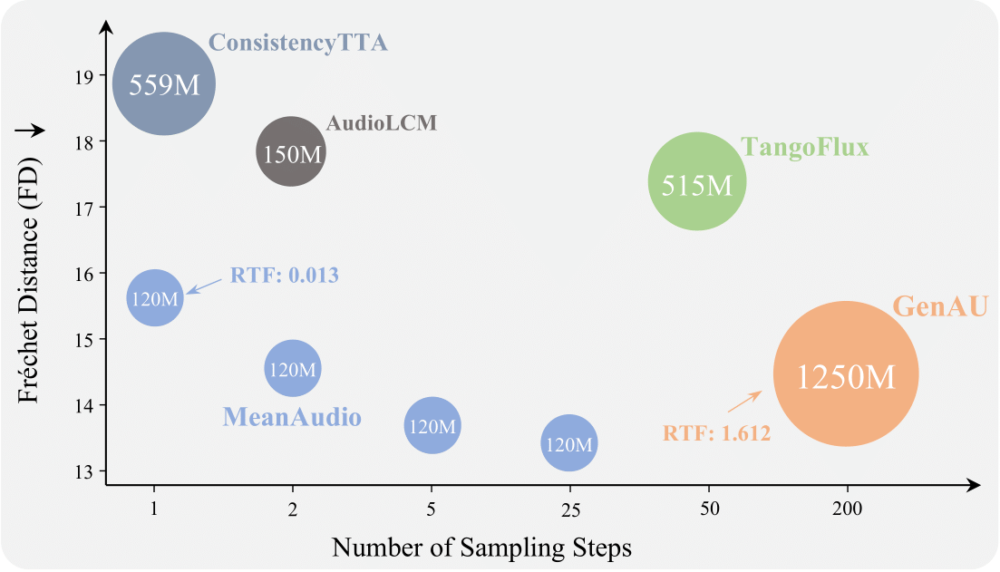

<div align="center">
<p align="center">
  <h1>MeanAudio: Fast and Faithful Text-to-Audio Generation with Mean Flows</h1>
  <!-- <a href=>Paper</a> | <a href="https://meanaudio.github.io/">Webpage</a>  -->

  [](https://arxiv.org/abs/2508.06098)
  [](https://huggingface.co/AndreasXi/MeanAudio)
  [](https://huggingface.co/spaces/chenxie95/MeanAudio)
  [](https://meanaudio.github.io/)


</p>
</div>

## News 🔥
- [Update Aug. 27, 2025] We present a new variant of MeanAudio: [MeanAudio-L-Full](https://huggingface.co/AndreasXi/MeanAudio/blob/main/meanaudio_l_full.pth) a 480M latent flow transformer achieving SOTA performance on both single-step and multi-step audio generation. Try it out at our [🤗 huggingface space](https://huggingface.co/spaces/chenxie95/MeanAudio) !

- [Update Aug. 17, 2025] We present [MeanAudio-S-Full](https://huggingface.co/AndreasXi/MeanAudio/blob/main/meanaudio_s_full.pth): a 120M latent flow transformer trained with the MeanFlow objective on ~10,000 hours of audio data sourced from AudioCaps, AudioSet, WavCaps, VGGSound, MusicCaps, and LP-MusicCaps. 

## Overview 
MeanAudio is a novel MeanFlow-based model tailored for fast and faithful text-to-audio generation. It can synthesize realistic sound in a single step, achieving a real-time factor (RTF) of 0.013 on a single NVIDIA 3090 GPU. Moreover, it also demonstrates strong performance in multi-step generation.

<div align="center">
  
</div>


## Environmental Setup

**1. Create a new conda environment:**

```bash
conda create -n meanaudio python=3.11 -y
conda activate meanaudio
pip install torch torchvision torchaudio --index-url https://download.pytorch.org/whl/cu118 --upgrade
```
<!-- ```
conda install -c conda-forge 'ffmpeg<7
```
(Optional, if you use miniforge and don't already have the appropriate ffmpeg) -->

**2. Install with pip:**

```bash
git clone https://github.com/xiquan-li/MeanAudio.git

cd MeanAudio
pip install -e .
```

<!-- (If you encounter the File "setup.py" not found error, upgrade your pip with pip install --upgrade pip) -->


## Quick Start

<!-- **1. Download pre-trained models:** -->
To generate audio with our pre-trained model, simply run: 
```bash 
python demo.py --prompt 'your prompt' --num_steps 1
```
This will automatically download the pre-trained checkpoints from huggingface, and generate audio according to your prompt. 
By default, this will use [meanaudio-s-full](https://huggingface.co/AndreasXi/MeanAudio/blob/main/meanaudio_s_full.pth). 
The output audio will be at `MeanAudio/output/`, and the checkpoints will be at `MeanAudio/weights/`. 

Alternatively, you can download manually the pre-trained models from this [Folder](https://drive.google.com/drive/folders/1nbIsVjl4pqLaAnqj-M8UPkahu28S59Kj?usp=sharing), and put them into `MeanAudio/weights/`. Then, you can use `scripts/meanflow/infer_meanflow.sh` and `scripts/flowmatching/infer_flowmatching.sh` to generate audio with pre-trained models. 

## MeanAudio Model Family 

| Model Name  | Size | Dataset | Objective | Pre-trained | Link | 
|---|---|---|---|---|---|
| MeanAudio-S-AC | 120M | AudioCaps | Mean Flow | FluxAudio-S-Full | [Here](https://huggingface.co/AndreasXi/MeanAudio/blob/main/meanaudio_s_ac.pth)| 
| FluxAudio-S-Full | 120M | All $^*$ | Flow Matching | - | [Here](https://huggingface.co/AndreasXi/MeanAudio/blob/main/fluxaudio_s_full.pth)
| MeanAudio-S-Full | 120M | All $^*$ | Mean Flow | - | [Here](https://huggingface.co/AndreasXi/MeanAudio/blob/main/meanaudio_s_full.pth) | 
| MeanAudio-L-Full | 480M | All $^*$ | Mean Flow | - | [Here](https://huggingface.co/AndreasXi/MeanAudio/blob/main/meanaudio_l_full.pth)


$^*$: All denotes AudioCaps + WavCaps + AudioSet + VGGSound + LP-MusicCaps-MC + LP-MusicCaps-MTT, forming approximately 3M of audio-text pairs (about 10,000 hours audio data). 
<!-- 1. [fluxaudio_s_full.pth](https://drive.google.com/file/d/180nrqkO3t9hvlg_l8wN9uv1RoKoFyzrV/view?usp=drive_link): The Flux-style flow transformer trained on AudioCaps, AudioSet, WavCaps, VGGSound, MusicCaps and LP-MusicCaps with the **standard flow matching objective**. It is capable of generating audio with multiple ($\geq 25$) sampling steps. You can run `scripts/flowmatching/infer_flowmatching.sh` to generate sound with this model.

2. [meanaudio_s_ac.pth](https://drive.google.com/file/d/11eQ3i5TJkU8b8S30PkHSgVozoNMWgCis/view?usp=drive_link): The Flux-style flow transformer fine-tuned on AudioCaps with the **Mean Flow Objective**, supporting both single-step and multi-step audio generation. You can run `scripts/meanflow/infer_meanflow.sh` to generate sound with it. 

3. [meanaudio_s_full.pth](https://drive.google.com/file/d/1zGiZrHZ6CuFKpsPe2hVgFD1FsNpBYQU_/view?usp=drive_link): The Flux-style flow transformer trained on AudioCaps, AudioSet, WavCaps, VGGSound, MusicCaps and LP-MusicCaps with the **Mean Flow Objective**. It is more stable than [meanaudio_s_ac.pth](https://drive.google.com/file/d/11eQ3i5TJkU8b8S30PkHSgVozoNMWgCis/view?usp=drive_link). You can run `scripts/meanflow/infer_meanflow.sh` to generate sound with it. 

4. Others: The [BigVGAN Vocoder](https://github.com/NVIDIA/BigVGAN): [best_netG.pt](https://drive.google.com/file/d/1PAJ7Asx_3e9HiaUoGIfSXI3K7BqgBR9x/view?usp=sharing). 
 The 1D VAE: [v1-16.pth](https://drive.google.com/file/d/1bJlNhGGjmDBKjz04bpOi-UjfuJILSiGU/view?usp=sharing). And the [CLAP](https://github.com/LAION-AI/CLAP) encoder:  
[music_speech_audioset_epoch_15_esc_89.98.pt](https://drive.google.com/file/d/1KGQ5Q8xHOoItPDdJAB8ry6kKJ5HkMyo9/view?usp=share_link):  -->

## Training
Before training, make sure that all files from [here](https://huggingface.co/AndreasXi/MeanAudio) are placed in `MeanAudio/weights`. 

### 1. Latent & Text Feature Extraction: 
We first extract VAE latents & text encoder embeddings to enable fast and efficient training. For this, `scripts/extract_audio_latents.sh` provides a detailed guide for it. The pipeline includes two steps: a) partition audios into 10s clips. b) extract latents & embeddings into npz files. 

*To avoid the laborious data pre-processing step, we have uploaded an extracted version of [AudioCaps](https://audiocaps.github.io). Feel free to download it from this [link](https://drive.google.com/file/d/1C_P3ZQQWxUgMuCw-qvYj2C2r0iM35Sfy/view?usp=share_link), unzip it and put it under `MeanAudio/data/`. Then you can directly jump to the second step.* 😊

However, if you want to train the model on other datasets besides AudioCaps, you should still run `scripts/extract_audio_latents.sh` to do feature extraction. 
Remember to adjust `config/data/t5_clap.yaml` for correct metadata paths. 
### 2. Install Validation Packages: 
We rely on [av-benchmark](https://github.com/hkchengrex/av-benchmark) for validation & evaluation. Please install it first before training.

### 3. Train with MeanFlow objective: 
Use the script below to train a MeanAudio model. By default, this will initialize the flow transformer from the pretrained ckpt `fluxaudio_fm.pth` and do MeanFlow fine-tuning. 
```bash
bash scripts/meanflow/train_meanflow.sh
```

### 4. (Optional) Pre-training with Standard Flow Matching: 
Use the script below to train a Flux-style transformer using the conditional flow matching objective: 
```bash 
bash scripts/flowmatching/train_flowmatching.sh
```
The obtained model can serve as a strong initialization for the mixed-flow fine-tuning. 

## Evaluation

Use the script below to do evaluation, before this, please first install [av-benchmark](https://github.com/hkchengrex/av-benchmark) for metrics calculation. You can specify `num_steps` and `ckpt_path` to evaluate different models with different sampling steps. 
```bash
bash scripts/meanflow/eval_meanflow.sh 
```

## Citation

```bibtex
@article{li2025meanaudio,
  title={MeanAudio: Fast and Faithful Text-to-Audio Generation with Mean Flows},
  author={Li, Xiquan and Liu, Junxi and Liang, Yuzhe and Niu, Zhikang and Chen, Wenxi and Chen, Xie},
  journal={arXiv preprint arXiv:2508.06098},
  year={2025}
}
```


## Acknowledgement

Many thanks to:
- [MMAudio](https://github.com/hkchengrex/MMAudio) for the MMDiT code and training & inference structure
- [MeanFlow-pytorch](https://github.com/haidog-yaqub/MeanFlow) and [MeanFlow-official](https://github.com/Gsunshine/meanflow) for the mean flow implementation
- [Make-An-Audio 2](https://github.com/bytedance/Make-An-Audio-2) BigVGAN Vocoder and the VAE
- [av-benchmark](https://github.com/hkchengrex/av-benchmark) for benchmarking results
